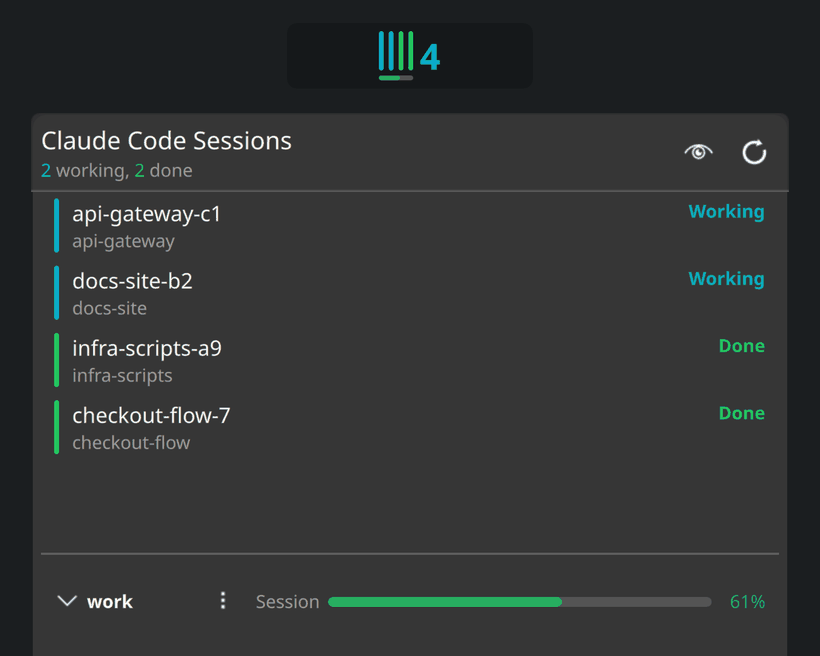
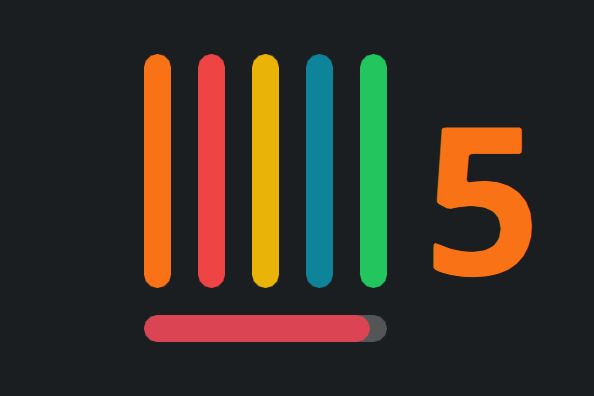
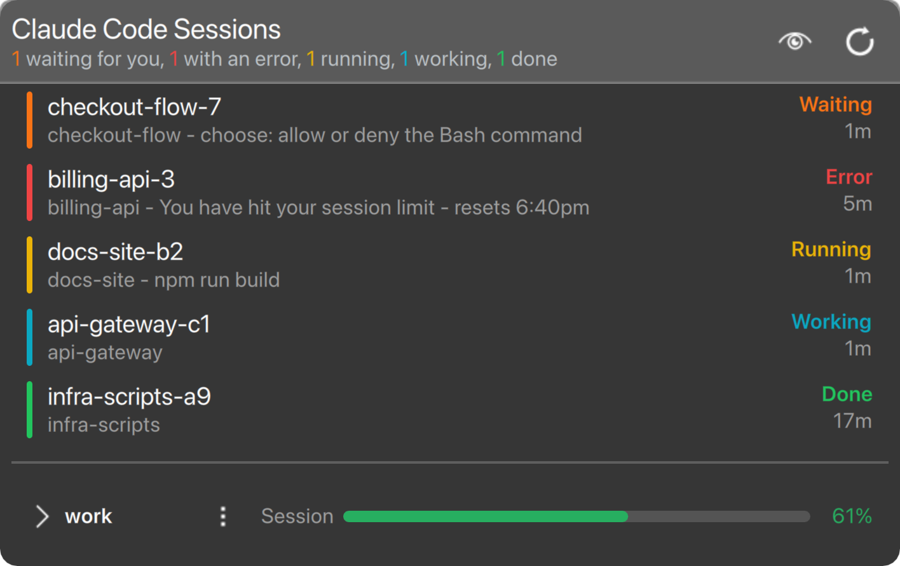
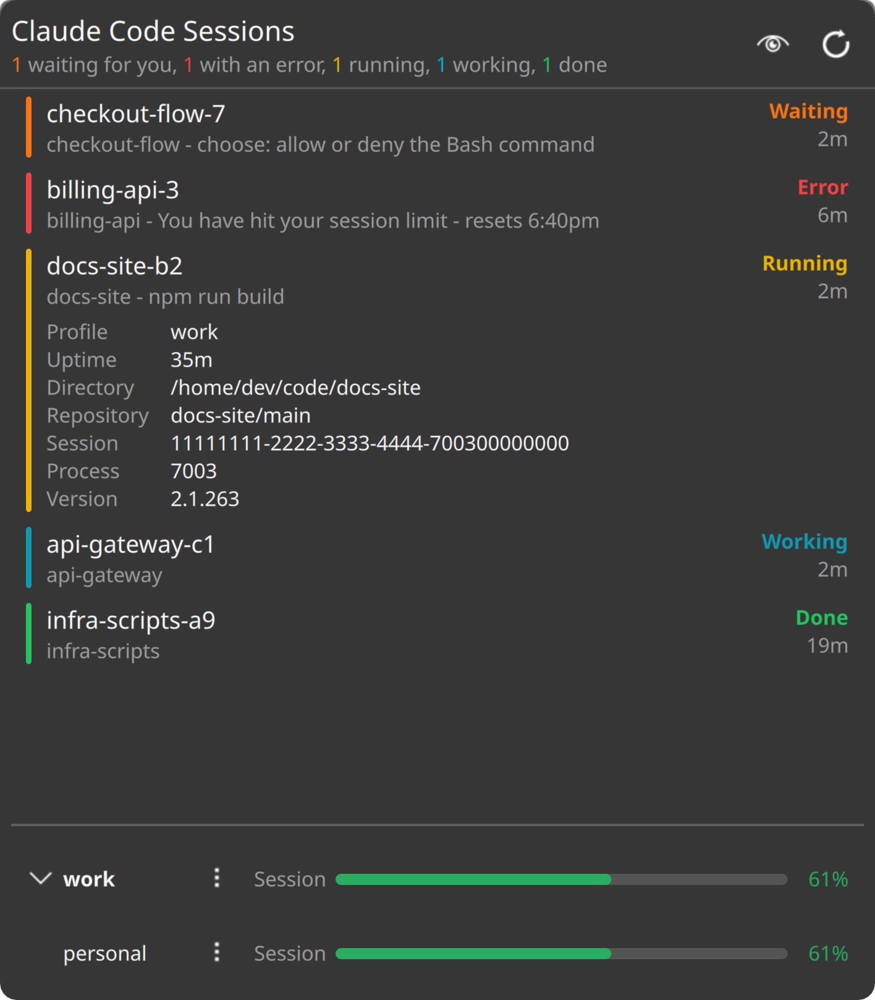
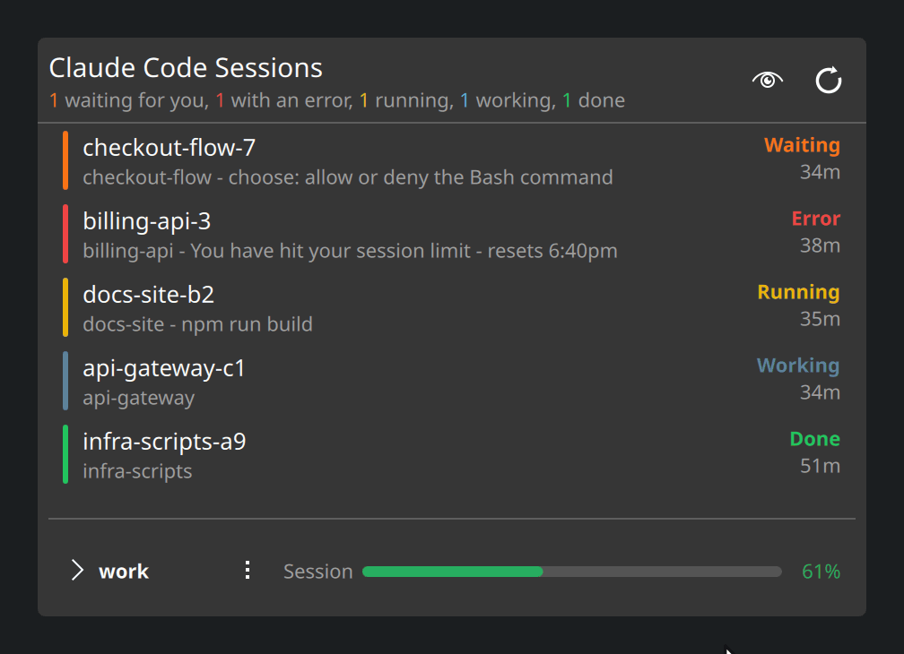
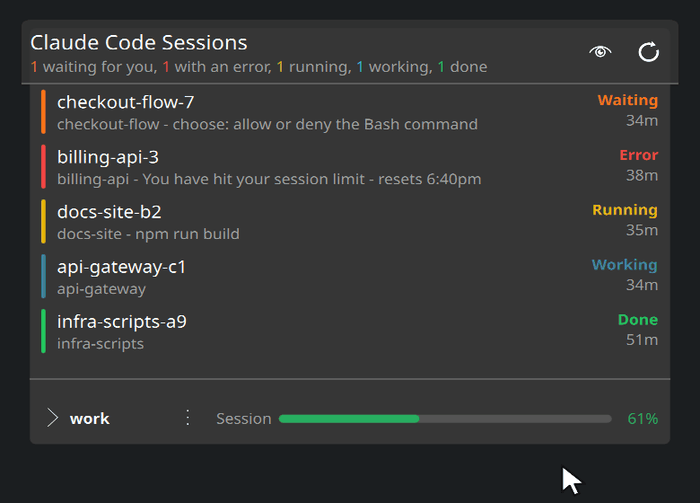
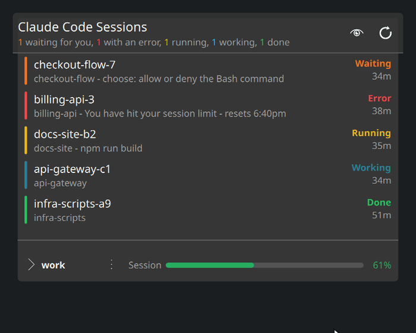

<div align="center">


<h1>Claude Sessions</h1>

<p><b>See which of your Claude Code sessions needs you, from your Plasma panel.</b></p>

<p>


<a href="LICENSE"></a>
</p>

<p>
<a href="#features">Features</a> •
<a href="#reading-the-panel">Reading the panel</a> •
<a href="#install">Install</a> •
<a href="#how-it-works">How it works</a>
</p>



</div>

Run several Claude Code sessions at once and the interesting question stops being
*what is Claude doing* and becomes **which one is waiting on me**. This puts the
answer in your panel: one bar per session, coloured by what that session is
doing, so a glance is enough.

## Features

- **Live status for every session** - waiting on you, stopped on an error,
  running a command, working, in a shell, or done.
- **No setup.** It reads the registry Claude Code already writes. No hooks, no
  wrappers, no config files to place.
- **A popup with the details** - directory, git repository and branch, uptime,
  session id, pid. Click any value to copy it.
- **Your plan usage**, per account, for whichever limit you care about.
- **Two accounts side by side**, if you run a second Claude Code config
  directory.
- **Native Plasma theming**, with every status colour overridable.

## Reading the panel

<div align="center">

</div>

<div align="center">

| | State | Meaning |
|:--:|---|---|
|  | **Error** | its last turn failed, and the message is shown |
|  | **Waiting** | blocked on you, and it says what for |
|  | **Running** | a command or script is executing, and it says which |
|  | **Working** | Claude is generating |
|  | **Shell** | the terminal has been handed to a shell |
|  | **Done** | finished, waiting for your next prompt |

</div>

The number beside the bars is the session count, coloured by whichever state has
the most sessions - unless something is waiting on you, which always takes
priority. Underneath sits a thin bar for your plan usage, which turns amber
and then red as the limit fills.

## The popup

Click the widget for the full list, sorted so whatever is blocked sits at the
top. Click a row to open its details; click any value to copy it. Right-click
copies the whole row, or the command to drop back into that session.

<table>
<tr>
<td width="50%"></td>
<td width="50%"></td>
</tr>
<tr>
<td align="center"><sub>Every session, worst first</sub></td>
<td align="center"><sub>One session, opened up</sub></td>
</tr>
</table>

<div align="center">

<p><sub>Open a session, click a value to copy it, or right-click for all of it</sub></p>
</div>

Hovering a row gives you a pencil, to rename it to something you will recognise,
and a close button that asks before ending the session. The eye in the header
blanks every name and path for screen-sharing.

<div align="center">

<p><sub>Rename one, or end one - the second click is the confirmation</sub></p>
</div>

## Plan usage

At the bottom, how much of your plan each account has used. Pick the limit each
one tracks - session, weekly, or a model-scoped one - and the panel bar follows
whichever you chose.

<div align="center">

<p><sub>Both accounts at once, green to amber to red as the limit fills</sub></p>
</div>

## Install

Requires **Plasma 6**, **fish 3.2+**, `jq`, `curl` and `kpackagetool6`.

```fish
git clone https://github.com/Pedroou/claude-sessions-widget
cd claude-sessions-widget
./install.fish
```

Then right-click your panel → **Add or Manage Widgets…** → search **Claude
Sessions**.

Upgrading while the widget is already on the panel needs a shell restart, since
Plasma caches applet QML. `install.fish` prints the command.

## Configuration

Right-click the widget → **Configure…**. Four pages, split by where each setting
takes effect:

- **General** - how often to check, the needs-attention highlight, and the
  privacy toggle. Plus one button that resets every page.
- **Panel** - the session count and its size, and the usage bar: whether to show
  it, how used the limit must be before it appears, and whether it colours by
  severity.
- **Popup** - how many sessions it shows before scrolling, which rows an expanded
  session has, and where the branch goes.
- **Colours** - all six status colours.

## How it works

Claude Code already publishes most of this. Every running session maintains a
record at `<config-dir>/sessions/<pid>.json` and rewrites it as its state
changes, so the widget is a reader of a file the tool already writes.

Two of the six states are **not** in that record and are worked out here:

**Running** comes from the process tree. Claude Code executes every Bash tool
call as a direct child shell of its own process, while its long-lived children
are MCP servers, which are not shells - so the two never get confused, and the
command itself is recoverable from the child's `cmdline`.

**Error** comes from the transcript, whose last assistant entry carries
`isApiErrorMessage` and a message worth reading. The transcript lags live state
badly, which is exactly why it is trusted only for a session that has already
stopped.

Records outlive sessions that were killed rather than closed, so each is checked
the way Claude Code checks its own: the process must exist **and** its start time
in `/proc` must match the record, which rules out a recycled pid.

Everything with a decision in it lives in two fish collectors and two Qt-free
JavaScript files, all four testable without a running Plasma shell:

```fish
fish --no-config test/test-collectors.fish   # 70 assertions
node --test test/sessions.test.js            # 29
node --test test/usage.test.js               # 19
```

The fish suite builds a throwaway `$HOME`, a throwaway `/proc` **and** throwaway
transcripts, then runs the real collectors against them - so a recycled pid, a
half-written record, an MCP child that is not a command, and a command starting
with `--` that `jq` would otherwise eat as a flag are covered rather than
assumed.

[`docs/design.md`](docs/design.md) is the full write-up, and
[`docs/limitations.md`](docs/limitations.md) is honest about what it cannot do.

## Privacy

The only part that touches the network is the plan-usage bar, which asks
Anthropic for your limits using the login Claude Code already stores. The token
goes to `curl` through stdin rather than argv, so it never appears in the process
list, and the whole feature has an off switch. Nothing else leaves the machine,
and nothing is written to your Claude Code config.

## Licence

MIT - see [LICENSE](LICENSE).
